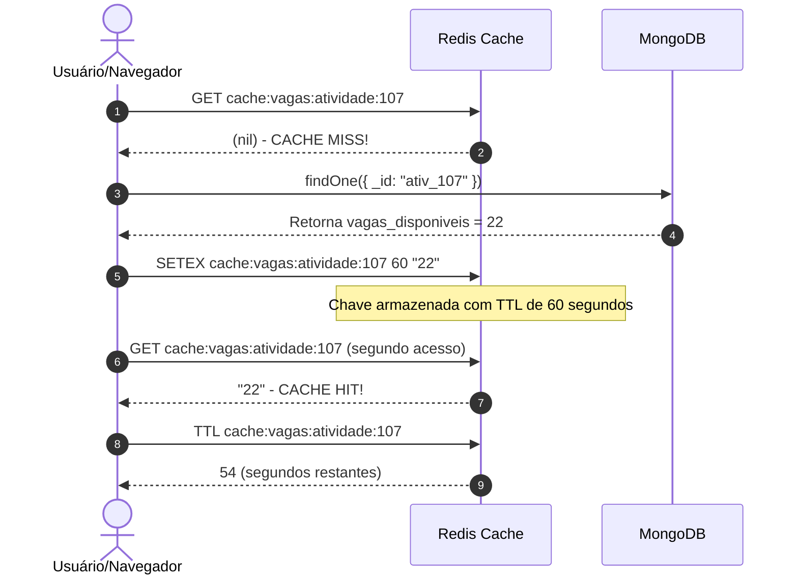

# 📑 RELATÓRIO TÉCNICO - PROJETO NOSQL (MONGODB E REDIS)
**Instituto Federal de Minas Gerais (IFMG) - Campus Ouro Preto**  
**Curso:** Análise e Desenvolvimento de Sistemas (ADS)  
**Disciplina:** Banco de Dados 2  
**Alunos:** Alessandro Oliveira de Jesus; Geraldo Otávio Figueiredo Pereira
**Professor:** João Paulo Fernandes de Cerqueira César

---

## 1. Descrição e Delimitação do Cenário

O cenário escolhido para este trabalho prático é a gestão do **I Congresso Nacional de Análise e Desenvolvimento de Sistemas (CONADS 2026)**.

### Delimitação do Problema:
O evento conta com centenas de estudantes e profissionais inscritos em atividades de diferentes formatos:
- **Palestras:** Apresentações de mercado de grande público.
- **Oficinas Práticas:** Worshops em laboratórios com número estrito de vagas.
- **Rodas de Conversa:** Debates entre alunos, professores e egressos.
- **Cross-Fire:** Painéis de discussão técnica e comparação direta entre ferramentas de desenvolvimento (ex: Docker vs Podman, React vs Vue vs Angular, MongoDB vs PostgreSQL).

### Necessidade de Dados e Divisão de Responsabilidades:
1. **MongoDB (Armazenamento Permanente e Estruturado):** Guardar com segurança o cadastro completo de eventos, participantes, atividades e o histórico oficial de inscrições. Responsável por pesquisas complexas, filtros e agregações estatísticas. Funciona tanto via contêiner Docker local quanto via cluster na nuvem (**MongoDB Atlas Cloud**).
2. **Redis (Armazenamento Temporário de Alta Velocidade):** Resolver gargalos de performance em horários de pico. Gerenciar cache de vagas com expiração (TTL), resumos em memória (Hashes), ranking de popularidade das atividades (Sorted Sets) e filas de espera ordenadas por ordem de chegada (Lists) para oficinas esgotadas. Funciona tanto localmente quanto em instância na nuvem (**Redis Cloud**).

---

## 2. Modelagem do MongoDB e Justificativa de Decisões

O banco de dados MongoDB (`congresso_ads`) foi modelado em **4 coleções**, totalizando **23 documentos** de teste.

```
+-------------------+      +-------------------+      +-------------------+
|     eventos       |      |    atividades     |      |   participantes   |
+-------------------+      +-------------------+      +-------------------+
| _id               |1    N| _id               |      | _id               |
| nome              |<-----+ evento_id (Ref)   |      | nome              |
| edicao, ano       |      | titulo, tipo      |      | matricula, tipo   |
| tema_principal    |      | palestrante {Emb} |      | contato {Emb}     |
| local             |      | ferramentas [Emb] |      | endereco {Emb}    |
+-------------------+      | vagas_disponiveis |      +-------------------+
                           +-------------------+        ^
                                     ^ 1                | 1
                                     |                  |
                                     | N                | N
                           +----------------------------------+
                           |           inscricoes             |
                           +----------------------------------+
                           | _id                              |
                           | participante_id (Ref)            |
                           | atividade_id (Ref)               |
                           | data_inscricao, status           |
                           +----------------------------------+
```

### Justificativa da Estratégia de Modelagem:

#### A. Uso de Documentos Embutidos (Embedding):
- **Na coleção `participantes`:** Os campos `contato` (email, telefone) e `endereco` (cidade, estado) foram **embutidos** no próprio documento do participante.
  - *Justificativa:* Esses dados possuem cardinalidade 1:1, são consultados sempre juntos com o participante e não possuem existência independente. Embutir elimina a necessidade de fazer joins (`$lookup`) desnecessários.
- **Na coleção `atividades`:** Os campos `palestrante` (nome, bio, empresa) e a lista `ferramentas_comparadas` (no caso de Cross-fires) foram **embutidos**.
  - *Justificativa:* Evita ler coleções secundárias durante a montagem da grade horária no site.

#### B. Uso de Referências (Referencing):
- **Na coleção `inscricoes`:** Mantém referências via ID para `participante_id` e `atividade_id`.
  - *Justificativa:* Trata-se de um relacionamento N:M de crescimento indeterminado. Embutir milhares de inscrições dentro de uma atividade poderia estourar o limite de 16MB do BSON do MongoDB.

---

## 3. Operações e Consultas no MongoDB

### A. Operações CRUD
1. **Inserção (`insertOne`):** Cadastro de novos participantes com documento embutido de contato.
2. **Atualização (`updateOne` com `$inc`):** Decremento de vagas disponíveis ao confirmar inscrição.
3. **Desativação Lógica (Soft Delete):** Atualização do campo `status: "cancelada"` em `inscricoes` em vez de remover o registro do disco, preservando a auditoria.

### B. Consultas com Filtros e Operadores
1. **Operador `$gte`:** Busca atividades com 15 ou mais vagas livres (`db.atividades.find({ vagas_disponiveis: { $gte: 15 } })`).
2. **Operador `$in`:** Lista eventos do tipo Cross-fire ou Oficina (`db.atividades.find({ tipo: { $in: ["Cross-fire", "Oficina"] } })`).
3. **Operador `$regex`:** Busca participantes com email de domínio acadêmico (`/@.*ifmg\.edu\.br$/i`).
4. **Filtro em Array Embutido:** Busca Cross-fires que comparam a ferramenta 'Docker'.

### C. Aggregation Pipeline (3 Estágios Coerentes)
```javascript
db.atividades.aggregate([
  // Estágio 1: Filtrar apenas atividades ativas no congresso
  { $match: { status: { $ne: "cancelada" } } },
  
  // Estágio 2: Agrupar por tipo e calcular total de vagas oferecidas e vagas livres
  { 
    $group: { 
      _id: "$tipo",
      total_atividades: { $sum: 1 },
      total_vagas_oferecidas: { $sum: "$vagas_totais" },
      total_vagas_livres: { $sum: "$vagas_disponiveis" }
    } 
  },
  
  // Estágio 3: Ordenar pelo volume total de vagas oferecidas
  { $sort: { total_vagas_oferecidas: -1 } }
])
```

---

## 4. Criação e Justificativa do Índice no MongoDB

Foi criado o seguinte índice na coleção `atividades`:
```javascript
db.atividades.createIndex(
  { tipo: 1, vagas_disponiveis: -1 },
  { name: "idx_tipo_vagas" }
);
```
**Justificativa Técnica:** A consulta mais frequente no portal do congresso é a filtragem por tipo de atividade (Palestra, Oficina, Cross-fire) ordenada pela disponibilidade de vagas. Sem o índice, o MongoDB realiza um scan completo na coleção (`COLLSCAN`). Com o índice composto, a busca passa a ser do tipo `IXSCAN`, retornando o resultado em tempo O(log N).

---

## 5. Estruturas e Padrão de Chaves no Redis

Adotou-se um padrão claro de nomenclatura com *namespaces* separados por dois pontos (`:`):

| Estrutura Redis | Exemplo de Chave | Função no Cenário |
| :--- | :--- | :--- |
| **String com TTL** | `cache:vagas:atividade:101` | Armazena o número de vagas com expiração automática (TTL 60s). |
| **Hash** | `resumo:atividade:101` | Resumo leve com título, tipo e palestrante para leitura em milissegundos. |
| **Sorted Set (ZSET)** | `ranking:atividades:populares` | Ordena as atividades mais procuradas com base no Score de acessos/inscrições. |
| **List (FIFO)** | `fila:espera:atividade:104` | Fila por ordem de chegada para oficinas que atingiram limite de vagas. |

---

## 6. Explicação dos Dois Fluxos Integrados (MongoDB + Redis)

### Fluxo 1: Fluxo Completo de Cache (Miss -> Mongo -> Redis -> Hit)


### Fluxo 2: Inscrição, Invalidação de Cache, Ranking e Fila de Espera
1. Quando um estudante realiza a inscrição via formulário PHP/CLI:
2. A aplicação insere o registro permanente no MongoDB (`inscricoes.insertOne`).
3. O MongoDB decrementa o número de vagas (`atividades.updateOne` com `$inc`).
4. **Invalidação de Cache:** A chave `cache:vagas:atividade:<id>` é removida do Redis (`DEL`) para forçar que o próximo visitante leia a vaga atualizada do banco permanente.
5. **Ranking:** A atividade ganha pontos no Redis Sorted Set (`ZINCRBY ranking:atividades:populares 1 "<id>"`).
6. **Fila de Espera:** Caso a atividade esteja esgotada (vagas = 0), o aluno é adicionado no final da List do Redis (`RPUSH fila:espera:atividade:<id> "<aluno>"`).

---

## 7. Divisão de Atividades do Grupo

| Integrante | Atividades Realizadas |
| :--- | :--- |
| **Estudante 1 - Geraldo** | Modelagem das coleções no Mongo, criação do script de dados (`01_dados.js`), índices e Pipeline de Agregação. |
| **Estudante 2 - Alessandro** | Modelagem do Redis, criação dos comandos (`comandos_redis.txt`), testes de TTL, Sorted Set e Fila FIFO. |
| **Estudante 3 - Alessandro e Geraldo** | Desenvolvimento da aplicação Web em PHP, criação do CSS responsive, relatórios e README. |

---

## 8. Conclusão

O projeto demonstrou na prática a complementaridade entre MongoDB e Redis. O **MongoDB** se provou ideal para persistência flexível e consultas ricas de dados de negócios. O **Redis** atuou como uma camada indispensable de aceleração, reduzindo a carga no MongoDB e resolvendo problemas de concorrência com filas FIFO e rankings em tempo real.
